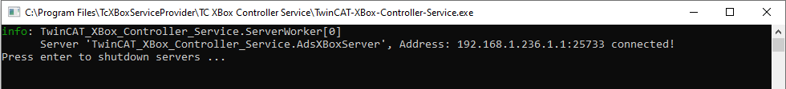
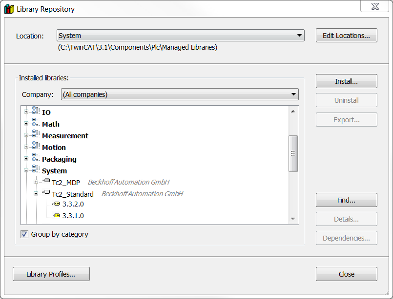

### Installing The Service

To make sure you have the latest version, visit the releases page. There will be a zip folder that includes the latest MSI installer for Windows 10.

Once the program is installed, you can start the service by launching it from the User Programs menu.

A successfully running service should look like this. You can then minimize the application to have it running in the background to host application data.

### Installing The PLC Library

After the service install process, there will be a PLC library placed at the location **C:\Program Files\Beckhoff Community\TwinCAT XBox Controller Service\PLC Library**. You will need to import this into the TwinCAT library repository before being able to use the functions. To do this, right-click the Resources folder inside a PLC project and use the install button.

